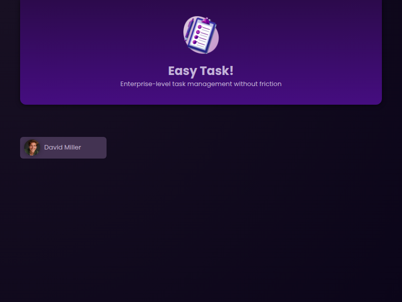
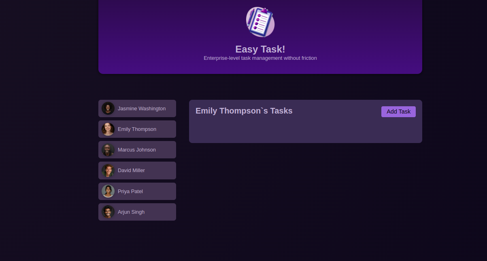

# **Commit: ng-content**

Las tareas no tienen un estilo adecuado

## Objetivo: Inyectar estilos en otros componentes

crea un componente compartido

```bash
ng g c shared/card --skip-tests
```

- Mueve este selector del componete user a card.component.css

```css
div {
  border-radius: 6px;
  box-shadow: 0 1px 6px rgba(0, 0, 0, 0.1);
  overflow: hidden;
}
```

- en user.component.html cambia <div></div> por
  <app-card></app-card>

### VISUALIZACION I

- Abre localhost:4200 en el navegador deberias ver:
  
  por defecto esta tecnica sustituye el html.

- Copia en card.component.html

```html
<div>
  <ng-content>
  card works!
</div>
```

### VISUALIZACION II

- Abre localhost:4200 en el navegador deberias ver:
  
  si queremos combinar ambos tenemos que usar <ng-content/>

- elimina la linea de card works!
- y cambia el <article> por <app-card> en task.component.html

### VISUALIZACION III

- Abre localhost:4200 en el navegador deberias ver:
  

fijate la hoja de tareas tiene las esquinas redondas, hemos "proyectado" el estilo
de users en users y en task , gracias a la técnica de <ng-content>
