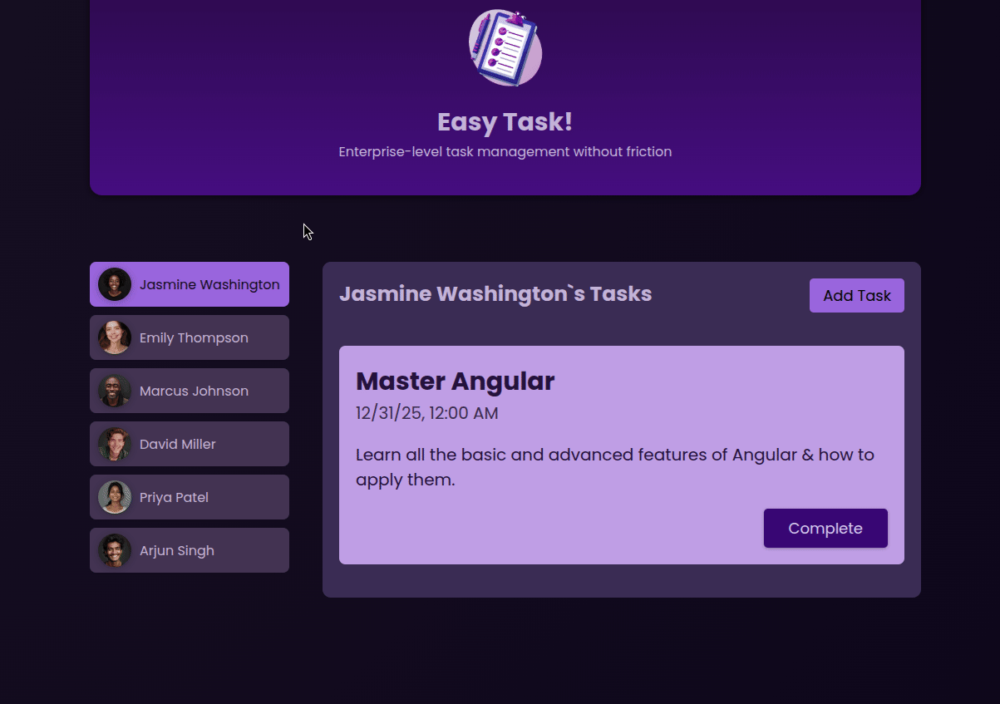

# **Commit: New-Task III: 2way-binding**

https://angular.dev/api/forms/NgModel
2way-binding consiste en actualizar el renderizado
conforme te introducen datos dinamicamente
es la union de property y event binding

## Objetivo: Exportar los datos del <form/> New-task a

- Importa FormsModule en new task, esto nos data acceso a ngModel

- Crea una propiedad vacia, "enteredTitle"

- En el html, en el <p/> de titulo añade este atributo

```ts
[ngModel] = "enteredTitle";
```

- Duplica el <p/> y cambia title por title2, para identificarlo mejor
  dejando intacto es 2waybinding

### VISUALIZACION

- Abre localhost:4200 en el navegador deberias ver:
  
  si tu ngModel funciona deberias poder replicar en vivo el mensaje
  en el parrafo copiado
