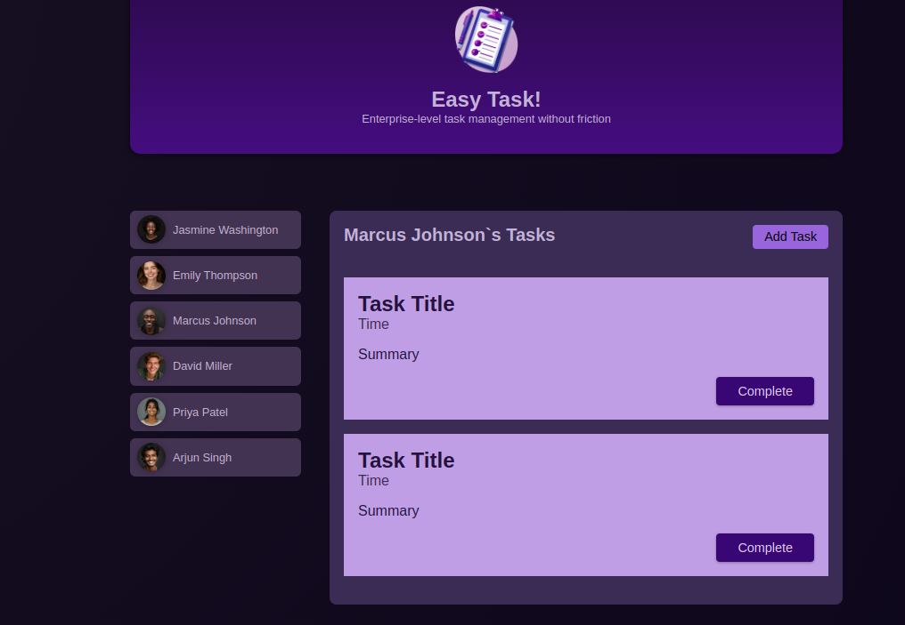

# **Commit: Task II: Desarrollo**

## Objetivo: desarrollar el componente task

- Copia el array tasks de tasks.component.ts

- Añade al html article que envuelve a un h2, time, p,
  p class="actions" que envuelve nu boton cuyo contenido es "Complete"

- En tasks.component.html enseña <app-task> en un bucle @for

- En tasks.component recibe la propiedad userId, exactamente igual que hicimos con name.
  es decir pon el decorador en tasks.component y en app.component bindeas

- ahora vamos a crear getter selectedUserTasks() que compare el userId recibido
  y el del objeto tarea para enseñar las tareas del usuario
  y no simplemente todas en cada usuario.
  pista: ".filter(()=>)" https://developer.mozilla.org/en-US/docs/Web/JavaScript/Reference/Global_Objects/Array/filter

-cambia "tasks" por el getter recien creado

```ts
@for (task of selectedUserTasks; track task.id) {
      <li>
        <app-task />
      </li>
    }
```

### VISUALIZACION

- Abre localhost:4200 en el navegador deberias ver:
  
  
  Deberias ver que los usuarios tienen distinto numero de tareas
