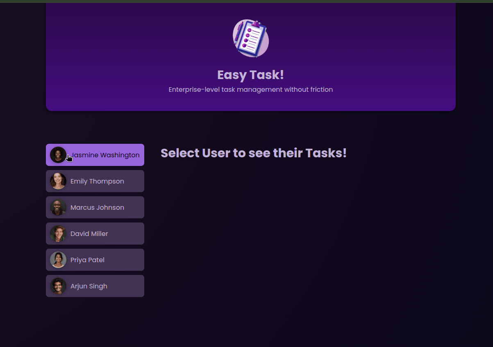

# **Commit: Reconectando el boton de complete**

## Objetivo: Formatea la fecha y crea un servicio

ve a task.component.ts

- injecta el servicio e importalo
- cambia el metodo onCompleteTask(id: string) para que use remove.task del servicio
- borra el @Output(), y su binding de tasks.component.html pues el servicio se encarga

### VISUALIZACION

- Abre localhost:4200 en el navegador deberias ver:
  
  deberias poder completar tareas
